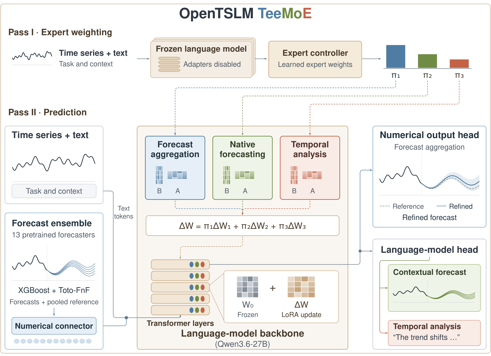

# OpenTSLM TeeMoE: A Unified Time-Series Language Model for Forecasting, Contextual Prediction, and Reasoning

Time-series applications call for more than accurate forecasts: they also require
understanding context and answering questions about the signals. OpenTSLM TeeMoE
brings these capabilities together in one language model. Three LoRA experts share
a frozen [Qwen3.6-27B](https://huggingface.co/Qwen/Qwen3.6-27B) backbone, with a
learned controller composing their weights for each request.

This repository provides the model's inference API, evaluation tools, and training
code as part of the [OpenTSLM](https://github.com/OpenTSLM) project.

[Paper](https://arxiv.org/abs/2609.40265) · [Hugging Face](https://huggingface.co/OpenTSLM/TeeMoE) ·
[News](#news) · [Installation](#installation) · [Quickstart](#quickstart-with-pretrained-models-on-hugging-face) ·
[More examples](#more-examples) · [Evaluation](#evaluation) ·
[Citation](#citation) · [Authors](#authors) · [License](LICENSE) · [Training](#training)

## News

- **October 2026:** Our [paper](https://arxiv.org/abs/2609.40265), code, and [pretrained model](https://huggingface.co/OpenTSLM/TeeMoE) are now available.
- 🎉 **September 2026:** OpenTSLM TeeMoE has been accepted to the [Foundation Models for Temporal Systems (FMTS) workshop at NeurIPS 2026](https://fmts-workshop.github.io/index.html#program)!

<p align="center">
  
</p>

## Capabilities

TeeMoE supports three kinds of time-series requests, from predicting future
measurements to interpreting patterns in observed signals:

- **Numerical forecasting:** refine an ensemble of pretrained forecasting models
  and return a probabilistic forecast.
- **Contextual forecasting:** predict future values using both the observed series
  and text, such as a planned promotion or a change in operating conditions.
- **Time-series analysis:** answer natural-language questions about one or two
  series, with optional multiple-choice answers.

## Results

The paper evaluates TeeMoE on three benchmarks covering these capabilities:

| GIFT-Eval · mean MASE rank ↓ | Context is Key · RCRPS ↓ | TimeSeriesExam · accuracy ↑ |
|:---:|:---:|:---:|
| 19.990 | 0.115 | 78.55% |

## Installation

### Before you start

The inference setup targets Linux with an NVIDIA 80 GB GPU, such as an H100.
You will need Git, [uv](https://docs.astral.sh/uv/), the CUDA toolkit (`nvcc`), and
a C++ compiler. TiRex compiles GPU kernels on first use. The setup script creates
Python 3.12 environments for you.

### Set up the repository

```bash
git clone https://github.com/OpenTSLM/OpenTSLM-TeeMoE
cd OpenTSLM-TeeMoE
bash scripts/setup.sh inference
source .venv/bin/activate
```

Keep this terminal in the repository directory for the commands below. In a new
terminal, run `source .venv/bin/activate` again before using the package.

You only need the `inference` setup to use the model on your own data. The full
setup, without that argument, also installs benchmark and training dependencies.

The forecasting models and vLLM have conflicting dependencies, so the script gives
them separate environments (`.venv-fm`, `.venv-moirai`, `.venv-timer`,
`.venv-tirex`, and `.venv-vllm`). Stay in the main `.venv`; TeeMoE starts the other
environments automatically.

## LLM Setup

TeeMoE uses [Qwen3.6-27B](https://huggingface.co/Qwen/Qwen3.6-27B) as its shared
language backbone. The TeeMoE checkpoint supplies the three expert adapters,
controller, and numerical prediction components. `TeeMoE.from_pretrained` loads
these components together; you do not need to assemble the experts yourself.

The backbone and external forecasting models are downloaded as needed. Allow
time and disk space for the first model load. On a single GPU, TeeMoE temporarily
offloads the backbone to CPU memory while other models run.

Load the pretrained checkpoint from [Hugging Face](https://huggingface.co/OpenTSLM/TeeMoE)
using `TeeMoE.from_pretrained("OpenTSLM/TeeMoE")`, or pass a local checkpoint directory.

## Quickstart with pretrained models on Hugging Face

### Load the model, forecast, and ask a question

Save the following as `example.py` in the repository directory. It creates a
simple series, forecasts its next 24 hours with additional context, and asks a
multiple-choice question about the observed pattern.

```python
import numpy as np
from teemoe import TeeMoE

model = TeeMoE.from_pretrained("OpenTSLM/TeeMoE")
history = (10 + np.sin(np.arange(168) / 12)).tolist()

forecast = model.forecast(
    history,
    horizon=24,
    frequency="h",
    start="2024-05-01 00:00",
    context="A promotion starts at the first forecast hour and lasts 24 hours.",
)
print(forecast.median)
print(forecast.quantiles.shape)  # (24, 9), quantile levels 0.1 through 0.9

answer = model.analyze(
    history,
    "Which pattern best describes the series?",
    options=["Periodic variation", "Constant values", "Steady increase"],
)
print(answer.text)
```

Run it with:

```bash
python example.py
```

Keep the model loaded when making more requests; you do not need to call
`from_pretrained` for each forecast or question.

### Use your own data

Replace `history` with a one-dimensional list or NumPy array of observations,
ordered from oldest to newest. You supply the observed values only, not the
future values you want to predict.

| Forecast argument | Meaning |
|---|---|
| `history` | Observed values in chronological order. |
| `horizon` | Number of future steps to predict. |
| `frequency` | Sampling interval, such as `"h"`, `"D"`, or `"15min"`. |
| `start` | Timestamp of the **first observation in the history**, not the first forecast step. |
| `context` | Optional text describing relevant events, constraints, or background. |

For example, 168 hourly observations beginning on May 1 end on May 7; a horizon
of 24 predicts the 24 hours of May 8. The frequency should match the spacing of
your observations.

### Read the output

Both forecasting paths return the same `Forecast` object:

| Field | What you get |
|---|---|
| `forecast.median` | One point forecast per future step, shape `(horizon,)`. |
| `forecast.quantiles` | Nine quantiles per step, shape `(horizon, 9)`, ordered from 0.1 to 0.9. |
| `forecast.timestamps` | Timestamps corresponding to the forecast steps. |
| `forecast.output` | `"numerical"` for the aggregation path or `"text"` for generated future values. |

`answer.text` contains the analysis response. When you supply multiple-choice
options, `answer.choice` is the zero-based index of the parsed choice, or `None`
if no option was recognized. The controller selects the model's output path;
you do not need to manually choose an expert.

## More examples

The snippets below reuse `model` and `history` from the quickstart. You can append
them to `example.py` or run them in the same Python session.

### Forecast without additional context

Omit `context` when you only have the observations:

```python
forecast = model.forecast(
    history, horizon=24, frequency="h", start="2024-05-01 00:00"
)
print(forecast.median)
```

The numerical path runs external forecasting models before refining their
ensemble. Its first call may therefore download and load additional models.

### Ask an open-ended question or compare two series

Omit `options` for a free-text response. To compare a pair, pass two series:

```python
answer = model.analyze(history, "Describe the overall pattern in this series.")
print(answer.text)

second_series = (np.asarray(history) + 2).tolist()
comparison = model.analyze(
    [history, second_series],
    "How do the patterns and levels of these two series compare?",
)
print(comparison.text)
```

### Process several requests together

Use the batch methods when you have several series or questions. They return
results in the same order as the input requests:

```python
second_series = (np.asarray(history) + 2).tolist()
forecasts = model.forecast_batch([
    dict(history=history, horizon=24, frequency="h", start="2024-05-01 00:00"),
    dict(history=second_series, horizon=24, frequency="h", start="2024-05-01 00:00",
         context="The equipment will be offline for the first six forecast hours."),
])

answers = model.analyze_batch([
    dict(series=history, question="Describe the trend."),
    dict(series=second_series, question="Is there a repeating pattern?"),
])

for result in forecasts:
    print(result.median)
for result in answers:
    print(result.text)
```

### Local checkpoints and GPU configuration

A local directory works in place of a Hugging Face model ID:

```python
model = TeeMoE.from_pretrained("checkpoints/teemoe")
```

By default, TeeMoE uses `cuda:0` and runs text generation with vLLM. For a
two-GPU setup, you can keep the backbone on GPU 0 and use GPU 1 for text
generation and the forecasting models. Use this **instead of** the model-loading
line in the quickstart:

```python
model = TeeMoE.from_pretrained(
    "OpenTSLM/TeeMoE",
    device="cuda:0",
    vllm_devices="1",
    forecast_devices=("cuda:1",),
)
```

Each GPU must have enough memory for the model assigned to it; these options
place workloads on devices rather than splitting the backbone across GPUs.

Alternatively, `TeeMoE.from_pretrained("OpenTSLM/TeeMoE", backend="transformers")`
runs text generation in the main process. It avoids a separate vLLM worker but
is slower. The default vLLM backend is recommended for normal use.

## Evaluation

You do not need to download the benchmarks to use TeeMoE on your own data. To
evaluate the model, first install the full set of dependencies:

```bash
bash scripts/setup.sh
source .venv/bin/activate
```

### GIFT-Eval

Download the benchmark data once, then run the evaluation. Start with `--gpus 0`
on a single GPU:

```bash
hf download Salesforce/GiftEval --repo-type dataset --local-dir data/gift-eval
python -m teemoe.eval.gift --gpus 0
```

To distribute the evaluation across an eight-GPU machine, use
`--gpus 0 1 2 3 4 5 6 7` instead. The summary is written to
`results/gift/report.json`. This is a full-benchmark evaluation, not a quick
installation test.

GIFT-Eval ranks are computed against the leaderboard results in the pinned
GIFT-Eval checkout, since ranks change when models are added. As in the paper,
the Toto-FnF part of the ensemble on GIFT-Eval is the forecast released with
[Toto-2.0-Family-and-Friends](https://huggingface.co/Datadog/Toto-2.0-Family-and-Friends)
(about 17 GB, downloaded on the first run); the eight pretrained forecasting
models and the five extra candidates are run by the evaluation.

Interrupted GIFT evaluations resume in the same output directory. Use a different
`--output` directory when changing checkpoints, evaluation settings, or GPU count;
incompatible cached results are rejected instead of silently reused.

### Context is Key and TimeSeriesExam

These evaluators download their benchmark data on first use:

```bash
python -m teemoe.eval.cik
python -m teemoe.eval.tse
```

The reports are written to `results/cik.json` and `results/tse.json` respectively.
Context is Key reports weighted RCRPS; TimeSeriesExam reports accuracy.

All three evaluators accept `--checkpoint` for a different model ID or local
directory. For example:

```bash
python -m teemoe.eval.tse --checkpoint checkpoints/teemoe --output results/tse-local.json
```

Run an evaluator with `--help` to see its GPU, backend, and output options.

## Citation

If you use TeeMoE in your work, please cite:

```bibtex
@misc{chen2026opentslmteemoe,
  title = {{OpenTSLM TeeMoE: A Unified Time-Series Language Model for Forecasting, Contextual Prediction, and Reasoning}},
  author = {Tony Chen and Timo Stoffregen and Maxwell Xu and Thomas Kaar and Martin Maritsch and Geremia Pompei and Nicolas Zumarraga and Robert Jakob and Paul Schmiedmayer and Patrick Langer and Juncheng Liu},
  year = {2026},
  eprint = {2609.40265},
  archivePrefix = {arXiv},
  primaryClass = {cs.LG},
  url = {https://arxiv.org/abs/2609.40265}
}
```

## Authors

OpenTSLM TeeMoE was made possible through the collaborative efforts of:

- Tony Chen (Columbia University; Stanford University)
- Timo Stoffregen (Aionic Labs)
- Maxwell Xu (Google)
- Thomas Kaar (Aionic Labs; Agentic Systems Lab, ETH Zürich)
- Martin Maritsch (Aionic Labs)
- Geremia Pompei (University of Pisa)
- Nicolas Zumarraga (Agentic Systems Lab, ETH Zürich)
- Robert Jakob (Aionic Labs; Agentic Systems Lab, ETH Zürich)
- Paul Schmiedmayer† (Stanford University)
- Patrick Langer† (Stanford University; Aionic Labs; Agentic Systems Lab, ETH Zürich)
- Juncheng Liu† (National University of Singapore)

† Shared last authors.

## License

This project is released under the [MIT license](LICENSE). The pretrained models
and datasets retain their respective licenses.

## Training

Training is optional: you can use the prepared checkpoint without rebuilding
datasets or fitting any adapters. To train your own model, the provided recipe
targets one eight-GPU node.

### Prepare the environment and data access

First accept the [Time-MQA/TSQA dataset](https://huggingface.co/datasets/Time-MQA/TSQA)
access terms on Hugging Face and authenticate; the analysis-data builder needs
access to this gated dataset. Then run:

```bash
bash scripts/setup.sh
source .venv/bin/activate
hf auth login
bash scripts/train.sh
```

### Training stages

This builds the training data from public sources, trains the experts and the
controller on one 8-GPU node, and writes `checkpoints/teemoe`, which loads with
`TeeMoE.from_pretrained("checkpoints/teemoe")`. The steps are:

| Step | Command | Output |
|---|---|---|
| Forecasting windows (GIFT-Eval training split, BOOM, RMISC, LOTSA, UTSD) | `python -m teemoe.data.aggregation` | `data/aggregation` |
| Contextual forecasting examples | `python -m teemoe.data.native` | `data/native/train.jsonl` |
| Analysis examples | `python -m teemoe.data.analysis` | `data/analysis/train.jsonl` |
| Forecasting-model ensemble | `python -m teemoe.train.aggregation prepare` | `artifacts/aggregation` |
| Aggregation expert | `torchrun … -m teemoe.train.aggregation editor` | `artifacts/aggregation/expert` |
| Native and analysis experts | `torchrun … -m teemoe.train.text` | `artifacts/native`, `artifacts/analysis` |
| Controller | `torchrun … -m teemoe.train.controller` | `artifacts/controller` |

Hyperparameters are in [`configs/`](configs/). Training uses fixed seeds and the
released model's data sources and sample counts. Rerunning the same script reuses
completed stages and resumes text-expert training when checkpoints are available.
See [`scripts/train.sh`](scripts/train.sh) for the individual commands if you
want to change the recipe or restart a particular stage.

### Use the trained checkpoint

After training finishes, load your model with:

```python
model = TeeMoE.from_pretrained("checkpoints/teemoe")
```

CAF uses the released model's cleaned row selection in `teemoe/data/caf_rows.json`.

Scripts for the paper's ablations and baselines are in [`paper/`](paper/).
